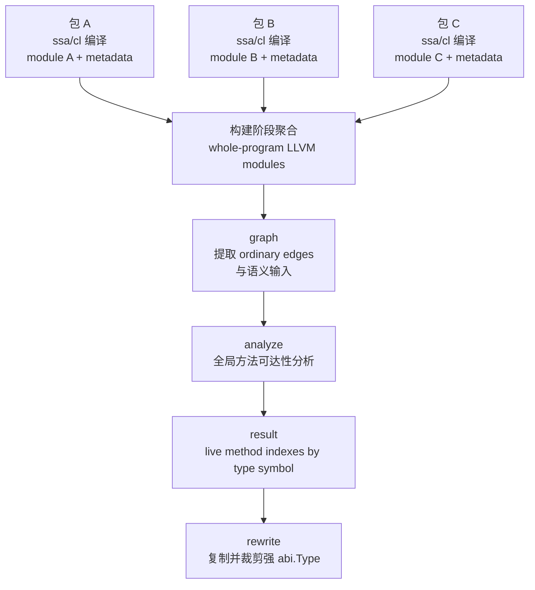

# Proposal: LLGo 链接期语义方法裁剪

## 状态

- 状态：Proposed
- 范围：定义 LLGo 在可执行构建路径上的链接期语义方法裁剪方案
- 当前落地范围：优先覆盖 `exe` 构建路径
- 背景：方案受 Go 链接期 deadcode 思路启发，但本文只定义 LLGo 自己的语义模型、输入契约与实现方向

## 摘要

LLGo 需要一种专门面向 Go 语义的链接期方法裁剪机制。

这个机制要解决的不是普通函数调用图上的不可达删除，而是另一类更难的问题：

1. 方法实现会通过 ABI type 常量、接口元数据、反射路径间接暴露出来。
2. 普通 `call/ref` reachability 无法表达“这个类型进入了接口动态分派域”。
3. 接口调用的语义是“某个接口的方法槽位被需求”，而不是“某个具体实现函数被直接引用”。
4. `MethodByName`、`reflect.Type.Method`、`reflect.Value.Method` 等能力会对方法保活产生额外影响。
5. 仅按“方法名 + 方法类型”匹配，会错误保活实际上并不满足接口的类型方法。

本文提出的方案是：

1. 在 `ssa/cl` 阶段显式发射 semantic metadata。
2. 在链接构建阶段聚合 whole-program 的 `[]llvm.Module`。
3. 从普通 LLVM 引用边和 semantic metadata 一起构建分析输入。
4. 进行多轮传播直至结果稳定的语义可达性分析。
5. 输出稳定结果 `type symbol -> live method indexes`。
6. 在分析结束后，再依据结果裁剪 ABI type 里的方法表，并回写强符号定义参与最终链接。

这不是一个“普通 DCE 更激进一点”的优化，而是一种 LLGo 应正式采用的链接语义。

## 问题定义

### 为什么普通 `gc-sections`、普通链接器 DCE、普通 IR DCE 不够

普通链接器和普通 IR DCE 依赖的是显式引用关系：

- 某个函数调用了另一个函数
- 某个全局常量引用了另一个全局符号
- 某个 initializer 里出现了对某个符号的普通引用

这套模型对 Go 不够，因为 Go 的方法调用能力本身不是纯粹的 direct reference 模型。

在 Go 里，一个方法是否必须保留，往往取决于以下语义事件：

1. 某个具体类型是否会进入接口动态分派世界。
2. 某个接口上的某个方法槽位是否真正被调用过。
3. 某个方法名是否通过 `MethodByName` 被按名字请求。
4. 是否出现了必须进入保守模式的反射调用。

这些事件如果不由编译器显式编码出来，链接阶段就只能看到一堆“类型常量引用了方法符号”，最终结果只能是：

- 只要类型描述符活着，方法很容易一起活下来。
- 无法区分“方法表里列出来”和“这个方法真的会被动态调用”。
- 无法在链接期精确删除一部分方法而保留另一部分方法。

### 一个最小化例子

可以先看下面这个简化后的 Go 程序：

```go
package main

type Reader interface {
	Read([]byte) (int, error)
}

type Writer interface {
	Write([]byte) (int, error)
}

type stringReader struct{}

func (*stringReader) Len() int                       { return 0 }
func (*stringReader) Read([]byte) (int, error)      { return 0, nil }
func (*stringReader) Close() error                  { return nil }
func (*stringReader) WriteTo(Writer) (int64, error) { return 0, nil }

func ReadAll(r Reader) {
	_, _ = r.Read(nil)
}

func main() {
	ReadAll(&stringReader{})
}
```

这个程序的语义很简单：

1. 接口 `Reader` 只要求一个方法：`Read([]byte) (int, error)`。
2. 具体类型 `stringReader` 却还带了别的方法，例如 `Len`、`Close`、`WriteTo`。
3. 程序里会把 `stringReader` 装箱成 `Reader`，并通过接口去调用 `Read`。

这里需要先强调一点：这并不是编译器额外塞进去的一堆“无关引用”，而是 Go 运行时本来就需要的能力。

当一个具体类型可能参与接口动态调用时，运行时必须能回答下面这些问题：

1. 这个具体类型有哪些方法。
2. 每个方法的名字是什么。
3. 每个方法的类型签名是什么。
4. 通过接口调用时应该跳到哪个函数入口。
5. 通过普通方法入口调用时应该跳到哪个函数入口。

因此，在带方法集的类型上，`abi.Type` / `abi.UncommonType` 本来就会带一张 `abi.Method` 表。  
这张表里的每一项都会携带方法名、方法类型，以及对应的 `IFn` / `TFn`。而 `IFn` / `TFn` 在 IR 里最终就是实打实的函数地址。

在当前 LLGo `v0.13.0` 中，这张方法表仍然是在编译期按完整 method set 一次性全量产出的。  
当前实现位置就在 `ssa/abitype.go`：

1. `abiType` 会为带方法集的类型生成 `abi.Type + abi.UncommonType + [N]abi.Method` 这种整体布局。
2. `abiUncommonMethods` 会按 `mset.Len()` 遍历完整方法集，逐项构造 `[N]abi.Method`，并把每个方法的 `Name / MType / IFn / TFn` 全部写进去。

所以，如果把上面这个程序编译成当前 LLGo 的 LLVM IR，就会看到：虽然语义上真正被需求的只是 `Reader.Read`，但 `stringReader` 的 pointer type descriptor 仍然会带着完整的方法表：

```llvm
@"*_llgo_github.com/goplus/llgo/cl/_testgo/reader.stringReader" = weak_odr constant
  { %"github.com/goplus/llgo/runtime/abi.PtrType",
    %"github.com/goplus/llgo/runtime/abi.UncommonType",
    [10 x %"github.com/goplus/llgo/runtime/abi.Method"] } {
    ...,
    [10 x %"github.com/goplus/llgo/runtime/abi.Method"] [
      { ..., ptr @"github.com/goplus/llgo/cl/_testgo/reader.(*stringReader).Len",     ptr @"github.com/goplus/llgo/cl/_testgo/reader.(*stringReader).Len" },
      { ..., ptr @"github.com/goplus/llgo/cl/_testgo/reader.(*stringReader).Read",    ptr @"github.com/goplus/llgo/cl/_testgo/reader.(*stringReader).Read" },
      { ..., ptr @"github.com/goplus/llgo/cl/_testgo/reader.(*stringReader).ReadAt",  ptr @"github.com/goplus/llgo/cl/_testgo/reader.(*stringReader).ReadAt" },
      ...,
      { ..., ptr @"github.com/goplus/llgo/cl/_testgo/reader.(*stringReader).WriteTo", ptr @"github.com/goplus/llgo/cl/_testgo/reader.(*stringReader).WriteTo" }
    ]
  }
```

同时，在普通函数体里还能看到这次接口装箱会把这个 type descriptor 直接引用进来：

```llvm
%2 = call ptr @"github.com/goplus/llgo/runtime/internal/runtime.NewItab"(
  ptr @"_llgo_iface$uycIKA3bbxRhudEjW1hHKWKdLqHQsCVy8NdW1bkQmNw",
  ptr @"*_llgo_github.com/goplus/llgo/cl/_testgo/reader.stringReader")
```

从普通 `gc-sections` 或普通 `lld` 的视角看，这是一条非常直接的强引用链：

```text
main / ReadAll
  -> stringReader 的 abi.Type
  -> abi.UncommonType / [10 x abi.Method]
  -> 每个 abi.Method 里的 Name / MType / IFn / TFn
  -> Len / Read / ReadAt / ... / WriteTo
```

问题就在这里：

1. 链接器看到的只是“一个活着的全局常量里含有真实函数指针和类型指针”。
2. 它并不知道语义上真正被需求的其实只是 `Reader.Read` 这个接口槽位。
3. 因此，只要 `@"*_llgo_github.com/goplus/llgo/cl/_testgo/reader.stringReader"` 变成可达，整个方法表里的所有方法都会跟着被保留。
4. 这不是 `lld` 的 bug，而是 ordinary reference graph 本身无法表达“同一个方法表里只有某几个槽位真的需要保留”。

这正是 LLGo 必须额外做语义分析的根本原因：

1. 先在 whole-program 视角上判断哪些类型真的进入了接口语义域。
2. 再判断哪些接口槽位真的被需求。
3. 最后只留下对应的 method indexes，而不是整张 `abi.Method` 表一起保活。

### 当前的核心问题

我们真正想回答的问题其实只有一个：

**某个类型的方法表里，哪些方法在运行时语义上真的需要保留。**

上面的例子已经说明了当前问题：

1. 某个具体类型的 type descriptor 一旦可达，普通引用图看到的就是“整张 `abi.Method` 表都跟着可达”。
2. 但我们真正需要的不是“类型活着，所以这个类型的方法全部都活着”。
3. 我们真正需要的是：类型本身可以保留，但方法表应该允许按运行时语义进行部分裁剪。

也就是说，链接期必须支持“类型保留、方法表部分裁剪”这件事，而 ordinary reference graph 本身表达不了这个能力。

从 Go 链接期 deadcode 的既有设计可以看出，这类问题并不是继续依赖普通引用图就能解决的。Go 的做法是让链接阶段显式理解与类型、接口、反射相关的额外语义，再在 whole-program 视角下执行专门的方法判活。

因此，LLGo 在方向上会采用类似思路：不试图把这个问题继续塞回 ordinary reference graph 里解决，而是引入一套单独的链接期语义分析模型。

## 与 Go 方案的关系

本方案明确受 Go 链接期 deadcode 思路启发，但并不打算复刻 Go 的内部实现细节。

LLGo 想吸收的是两类东西：

1. 处理问题的方向：把接口转换、接口方法调用、按名字取方法、反射保守模式等语义事件纳入链接期分析。
2. 分析方法本身：在 whole-program 视角上做多轮传播直至结果稳定的语义可达性分析，而不是仅依赖普通引用图。

LLGo 不打算照搬的是：

1. Go 的 object 格式与 loader 结构。
2. Go 的内部 relocation 编码方式。
3. Go 链接器的具体实现分层。

这两套方案最大的工程差异是语义输入的承载位置不同：

1. Go 把相关语义信息落在 `goobj` / relocation / type data / symbol attribute 体系里，例如类型进入接口语义域、接口方法需求、按名字取方法、反射保守标记等。
2. LLGo 则把这些语义信息显式发射到 `llvm.Module` 的 named metadata 中，再在链接构建阶段统一读取。

但两者在更高层语义上是一致的：

1. 都是在全局视角下收集普通可达边与语义事件。
2. 都会在 whole-program 范围上做多轮传播和收敛。
3. 都试图回答同一个问题：某个具体类型的方法表里，哪些槽位最终必须保留。

LLGo 当前方案还明确吸收并改进了一个 Go 现有保守点：

1. 不能只按“方法名 + 方法类型”去命中接口需求。
2. 还必须额外检查：这个具体类型是否完整实现了对应接口。

这样可以避免“未完整实现接口的结构体方法，只因为签名碰巧命中需求就被保活”的问题。

基于这层共性与差异，LLGo 的整体实现会采用“单包产出语义、全局统一分析、结果回写”的架构。

## 分析架构

本方案的核心特点是：

1. 单独编译某个包时，只额外产出这个包内部已经能够静态确定的语义信息。
2. 不在单包阶段提前决定某个方法最终是否保留。
3. 等 whole-program 的 `[]llvm.Module` 都准备好之后，再从全局视角统一分析方法可达性。

单包阶段究竟需要额外标记哪些语义，全局阶段又如何消费这些语义并完成方法判活，后文会分别详细展开；这里先给出整体架构。

这条链路可以概括为：



具体来说：

1. `ssa/cl` 阶段继续按包编译，但会额外把接口转换、接口方法需求、按名字取方法、反射保守标记、方法槽位信息等语义写进当前包的 `llvm.Module`。
2. 构建阶段拿到所有包的 `[]llvm.Module` 之后，`graph` 统一扫描所有 package 的普通引用边和这些 metadata，把它们聚合成一份 whole-program 输入。
3. `analyze` 在 whole-program 视角上执行多轮传播，最终只产出一份稳定结果：

```text
type symbol -> live method indexes
```

4. 一旦这份结果算出，分析行为本身就结束了。后续 `rewrite` 只负责消费结果，复制弱 `abi.Type` 定义、裁剪方法表、生成强符号，并在最终链接时覆盖原定义。

这里有两个关键分层：

1. 普通引用边仍然来自函数体、全局 initializer、常量表达式等 ordinary IR 内容。
2. 与接口、反射、方法表相关的额外语义，则由单包编译阶段显式产出，再在全局阶段统一消费。

### 目标与边界

本方案的目标是：

1. 为 LLGo 定义一套正式的链接期语义方法裁剪方案。
2. 在分析阶段稳定产出 `type symbol -> live method indexes`。
3. 基于该结果回写裁剪后的强 `abi.Type` 定义。

本方案当前不包含：

1. 复刻 Go 内部 object/relocation/loader 结构。
2. 一次性覆盖所有 build mode。
3. 同时讨论 SCCP、CFG DCE、常量传播等通用 IR 优化。

## Whole-program 信息模型

本节定义算法本身要求外部提供的一份归一化 whole-program 信息，记为 `WholeProgramInfo`。

这里的 whole-program 不是“某一个包的信息模型”，而是“所有参与本次链接的 package 信息聚合之后”的总输入。  
也就是说，`WholeProgramInfo` 的每个字段都应理解为：把所有 package 各自贡献出来的 ordinary edges、类型传播边、接口信息、方法槽位信息和语义需求统一合并后的结果。

`analyze` 的边界不是 LLVM IR，也不是 metadata 本身，而是这份已经整理好的 `WholeProgramInfo`。  
只要外部能够提供等价的信息，算法就不关心这些信息最终来自哪种对象格式、哪种扫描过程或哪种中间承载方式。

LLGo 当前实现中，这份 `WholeProgramInfo` 由构建阶段从所有 package 的 LLVM modules 聚合得到。
这也意味着：后续如果为了加速构建过程，希望缓存某个包已经提取好的语义信息，再在 whole-program 阶段直接组装成 `WholeProgramInfo`，算法本身并不需要改变。  
不过本期实现不涉及这种缓存；当前基线仍然是基于 `ssa -> llvm.Module` 的产物统一提取。

因此，下面各项定义中的 key 和 value，描述的都是 whole-program 聚合后的语义，而不是某个单独 package 的局部视图。

它的定义如下：

```go
type Symbol = string

type MethodSig struct {
	Name  string
	MType Symbol
}

type MethodSlot struct {
	Index int
	Sig   MethodSig
	IFn   Symbol
	TFn   Symbol
}

type IfaceMethodDemand struct {
	Target Symbol
	Sig    MethodSig
}

type WholeProgramInfo struct {
	OrdinaryEdges  map[Symbol]map[Symbol]struct{}
	TypeChildren   map[Symbol]map[Symbol]struct{}
	InterfaceInfo  map[Symbol][]MethodSig
	UseIface       map[Symbol][]Symbol
	UseIfaceMethod map[Symbol][]IfaceMethodDemand
	MethodInfo     map[Symbol][]MethodSlot
	UseNamedMethod map[Symbol][]string
	ReflectMethod  map[Symbol]struct{}
}
```

其中，`MethodSig` 不是一级输入项，而是 `MethodInfo` 与 `InterfaceInfo` 共用的方法签名表示。  
当前基线下：

1. `Name` 必须是规范化的方法名。
2. 导出方法直接使用方法名，例如 `Read`。
3. 非导出方法使用带完整包路径的规范化名字。
4. `MType` 是方法类型描述符的 symbol。

### `OrdinaryEdges`

`OrdinaryEdges` 表示普通可达边，也就是 ordinary symbol reachability graph。

外部需要提供的就是 ordinary `call/ref` 所形成的普通引用图。

例如：

```go
func helper() {}

func main() {
	helper()
}
```

在这个例子里：

1. `main -> helper` 会进入 `OrdinaryEdges`。
2. 这是普通 direct call。
3. 它不属于接口语义，也不需要额外 metadata。

也就是说：

1. key 是源符号。
2. value 是这个符号通过 ordinary `call/ref` 能直接到达的目标符号集合。

同样地，直接的结构体方法调用也属于 `OrdinaryEdges`。例如，下面这段代码：

```go
type S struct{}

func (*S) M() {}
func (S) N() {}

func main() {
	var s S
	s.M()
	s.N()
}
```

在这个例子里：

1. `main -> (*S).M` 和 `main -> S.N` 都仍然是 ordinary edge。
2. 因为 IR 里已经能直接看到具体的方法符号。
3. `s.M()` 虽然源码里写的是 value 调用，但因为 `s` 可寻址，最终会落到 `(*S).M`。

按当前 LLGo 实际生成出来的符号形状，结构化后可以直接写成：

```go
OrdinaryEdges = map[Symbol]map[Symbol]struct{}{
	"github.com/goplus/llgo/doc/tt.main": {
		"github.com/goplus/llgo/doc/tt.(*S).M": {},
		"github.com/goplus/llgo/doc/tt.S.N":    {},
	},
}
```

但接口方法调用不是这样。例如：

```go
type I interface{ M() }

func call(i I) {
	i.M()
}
```

这里不会把 `call -> 某个具体实现的 M` 直接记进 `OrdinaryEdges`，因为 IR 里并没有一个唯一的具体目标符号。  
这类调用会在后文通过额外语义信息单独表达。

### `TypeChildren`

`TypeChildren` 记录类型之间的直接传播边。

它的含义是：

1. 如果某个源类型已经进入接口/反射相关分析范围，
2. 那么沿着 runtime type data 能继续观察到的子类型，也必须继续进入同一分析范围。

注意：

1. 这里记录的是直接传播边，不是预先展开的传递闭包。
2. 递归闭包是在分析阶段沿这些边继续展开。

之所以需要它，是因为：

1. 一个类型一旦可能通过接口值和反射路径被继续观察，
2. 程序就有可能进一步拿到它内部涉及到的子类型，
3. 这些子类型的方法表同样可能影响最终哪些动态方法必须保留，
4. 因此分析器必须知道这种子类型传播关系。

例如：

```go
type Inner struct{}

func (Inner) M() {}

type Outer struct {
	F Inner
}

func main() {
	var x any = Outer{}
	_ = x
}
```

结构化地看，可以表达为：

```go
TypeChildren = map[Symbol]map[Symbol]struct{}{
	"_llgo_github.com/goplus/llgo/demo.Outer": {
		"_llgo_github.com/goplus/llgo/demo.Inner": {},
	},
}
```

### `MethodInfo`

`MethodInfo` 描述某个具体类型的方法槽位表。  
它不是“已经被需求的方法集合”，而是“分析器可判活的候选槽位集合”；当某个槽位首次命中时，分析器会从该槽位继续拉活 `MType/IFn/TFn`。
如果某个类型没有方法，那么它可以完全不出现在 `MethodInfo` 里。

例如，考虑 `demo/file.go`：

```go
package demo

type File struct{}

func (*File) Read([]byte) (int, error) { return 0, nil }
func (*File) Close() error             { return nil }
```

假设它编译后的包路径是 `github.com/goplus/llgo/demo`，则它对应的 `MethodInfo` 可以直接理解为：

```go
MethodInfo["_llgo_github.com/goplus/llgo/demo.File"] = []MethodSlot{
	{
		Index: 0,
		Sig: MethodSig{
			Name:  "Read",
			MType: "_llgo_func$A1...",
		},
		IFn: "github.com/goplus/llgo/demo.(*File).Read",
		TFn: "github.com/goplus/llgo/demo.File.Read",
	},
	{
		Index: 1,
		Sig: MethodSig{
			Name:  "Close",
			MType: "_llgo_func$B2...",
		},
		IFn: "github.com/goplus/llgo/demo.(*File).Close",
		TFn: "github.com/goplus/llgo/demo.File.Close",
	},
}
```

其中：

1. key 是具体类型 symbol。
2. value 是该类型按 `abi.Method` 槽位顺序排列的 `[]MethodSlot`。
3. 每一项都是一个 `MethodSlot`，其中 `Sig` 又是一个 `MethodSig`。
4. `Index` 必须与最终 `abi.Method` 表中的槽位索引完全一致。
5. `IFn` 和 `TFn` 在当前基线下都存在，但对某些方法它们可能相同。

### `InterfaceInfo`

`InterfaceInfo` 描述接口的方法集合。

例如，考虑 `demo/reader.go`：

```go
package demo

type Reader interface {
	Read([]byte) (int, error)
	Close() error
}
```

假设它编译后的包路径是 `github.com/goplus/llgo/demo`，则它对应的 `InterfaceInfo` 可以直接理解为：

```go
InterfaceInfo["_llgo_github.com/goplus/llgo/demo.Reader"] = []MethodSig{
	{
		Name:  "Read",
		MType: "_llgo_func$A1...",
	},
	{
		Name:  "Close",
		MType: "_llgo_func$B2...",
	},
}
```

其中：

1. key 是接口类型 symbol。
2. value 是该接口的方法签名集合，这里使用 `[]MethodSig` 表达。
3. 语义上它表示“这个接口完整要求哪些方法”；适配层需要负责去重和规范化。

### `UseIface`

`UseIface` 按 `Owner` 分组，value 是该 `Owner` 可达后需要进入 `UsedInIface` 的具体类型集合。

例如，考虑 `demo/reader.go`：

```go
package demo

type Reader interface {
	Read([]byte) (int, error)
}

type File struct{}

func (*File) Read([]byte) (int, error) { return 0, nil }

func main() {
	var r Reader = &File{}
	_ = r
}
```

假设它编译后的包路径是 `github.com/goplus/llgo/demo`，则它对应的 `UseIface` 可以直接理解为：

```go
UseIface = map[Symbol][]Symbol{
	"github.com/goplus/llgo/demo.main": []Symbol{
		"*_llgo_github.com/goplus/llgo/demo.File",
	},
}
```

### `UseIfaceMethod`

`UseIfaceMethod` 按 `Owner` 分组，value 是该 `Owner` 可达后产生的接口方法需求集合。

例如，考虑 `demo/reader.go`：

```go
package demo

type Reader interface {
	Read([]byte) (int, error)
}

func consume(r Reader, p []byte) {
	_, _ = r.Read(p)
}
```

假设它编译后的包路径是 `github.com/goplus/llgo/demo`，则它对应的 `UseIfaceMethod` 可以直接理解为：

```go
UseIfaceMethod = map[Symbol][]IfaceMethodDemand{
	"github.com/goplus/llgo/demo.consume": []IfaceMethodDemand{
		{
			Target: "_llgo_github.com/goplus/llgo/demo.Reader",
			Sig: MethodSig{
				Name:  "Read",
				MType: "_llgo_func$A1...",
			},
		},
	},
}
```

### `UseNamedMethod`

`UseNamedMethod` 按 `Owner` 分组，value 是该 `Owner` 可达后产生的方法名需求集合。  
只有当方法名在编译期可静态确定时，`MethodByName` 这类调用才会进入这里；如果方法名不是编译期常量，则会退化为后文的 `ReflectMethod`。

例如，考虑 `demo/lookup.go`：

```go
package demo

func lookup(v any) {
	_, _ = reflect.TypeOf(v).MethodByName("ServeHTTP")
}
```

假设它编译后的包路径是 `github.com/goplus/llgo/demo`，则它对应的 `UseNamedMethod` 可以直接理解为：

```go
UseNamedMethod = map[Symbol][]string{
	"github.com/goplus/llgo/demo.lookup": []string{
		"ServeHTTP",
	},
}
```

### `ReflectMethod`

`ReflectMethod` 是一个 owner 集合；当其中任意一个 `Owner` 可达时，分析必须进入保守的反射模式。  
典型来源包括 `reflect.Type.Method`、`reflect.Value.Method`，以及方法名无法在编译期静态确定的 `MethodByName`。

例如，考虑 `demo/value.go`：

```go
package demo

func valueByIndex(v any) {
	_ = reflect.ValueOf(v).Method(0)
}
```

假设它编译后的包路径是 `github.com/goplus/llgo/demo`，则它对应的 `ReflectMethod` 可以直接理解为：

```go
ReflectMethod = map[Symbol]struct{}{
	"github.com/goplus/llgo/demo.valueByIndex": {},
}
```

一旦命中这类输入，当前基线语义就是：对所有 `UsedInIface` 的具体类型，保留其导出方法对应的槽位。

## 核心算法

### 输入

算法输入有两部分：

1. 一份 whole-program 级别的 `WholeProgramInfo`
2. 一组链接入口 roots

其中：

1. `WholeProgramInfo` 是把所有参与本次链接的 package 语义信息聚合后的结果。
2. roots 是 ordinary reachability 的起点，例如 `main`、`_start`、`__main_argc_argv` 这类最终链接入口。

### 输出形式

分析器输出：

```go
type Result map[string]map[int]struct{}
```

语义是：

1. key 是具体类型 symbol。
2. value 是该类型最终保留的方法槽位索引集合。

这就是分析阶段的最终结果。  
算法在得到这份结果后即停止，不再继续处理 ABI type 重写或强符号生成；这些工作属于后续回写阶段。

### 判活循环

核心逻辑可以直接概括为一个“普通 flood + 语义需求传播 + 方法槽位判活”的循环：

1. 先从 roots 出发，沿 `OrdinaryEdges` 做普通可达性传播。
2. 每当某个 `owner` 变为可达，就读取它在 `UseIface`、`UseIfaceMethod`、`UseNamedMethod`、`ReflectMethod` 里的语义需求。
3. `UseIface` 会把具体类型加入 `UsedInIface`，并沿 `TypeChildren` 继续传播。
4. `UseIfaceMethod` 会为某个接口积累方法需求；`UseNamedMethod` 会积累按名字的需求；`ReflectMethod` 会打开保守反射模式。
5. 然后对所有已经进入 `UsedInIface` 的具体类型，检查它们的 `MethodInfo` 槽位，判断哪些槽位应该保活。
6. 其中最关键的一点是：接口方法需求只有在“该具体类型完整实现了对应接口”时，才允许命中这个类型上的槽位；不能只靠方法名和方法类型相同就直接保活。
7. 某个槽位一旦首次保活，就把该槽位对应的 `MType`、`IFn`、`TFn` 重新加入普通可达图。
8. 如此反复，直到没有新的 ordinary reachable symbol、没有新的语义需求、也没有新的 live method slot 为止。

最终得到的就是：

```text
type symbol -> live method indexes
```

如果某个类型进入了 `UsedInIface`，但没有任何方法槽位被判活，结果里仍然应保留它的空集合；这样回写阶段才能明确把该类型的方法表裁成空。

## 例子

### 例子一：接口调用只保留真正被需求的方法

考虑：

```go
type Reader interface {
	Read([]byte) (int, error)
}

type File struct{}

func (File) Read([]byte) (int, error) { return 0, nil }
func (File) Close() error             { return nil }

func consume(r Reader, p []byte) {
	_, _ = r.Read(p)
}

func main() {
	consume(File{}, nil)
}
```

分析过程如下：

1. `main` 是 root。
2. ordinary flood 让 `consume` 变为可达。
3. `main` 中的具体类型到接口转换触发 `UseIface(main, File)`。
4. `consume` 中的接口方法调用触发 `UseIfaceMethod(consume, Reader, Read)`。
5. `File` 进入 `UsedInIface`。
6. `Reader.Read` 成为接口方法需求。
7. `File` 完整实现 `Reader`。
8. `File` 方法表上 `Read` 对应槽位被保活。
9. `Close` 没有命中任何接口需求、名字需求或反射保守条件，因此保持不可达。

最终结果类似于：

```text
_llgo_example.File: [0]
```

其中 `0` 表示 `Read` 所在槽位。

### 例子二：不完整实现接口的类型不会被误保活

考虑：

```go
type A struct{}

func (*A) Foo() {}
func (*A) Bar() {}

type B struct{}

func (*B) Foo() {}
func (*B) Bar() {}
func (*B) Car() {}

type BI interface {
	Foo()
	Bar()
	Car()
}
```

假设程序中只出现了对 `BI.Foo` 和 `BI.Bar` 的接口调用需求。

分析过程如下：

1. `BI` 的需求集合中出现 `Foo` 和 `Bar`。
2. `A` 与 `B` 都可能进入 `UsedInIface`。
3. `A` 自己只有 `Foo` 和 `Bar`，缺少 `Car`。
4. 但 `BI` 完整要求的是 `Foo`、`Bar`、`Car`。
5. 因为 `A` 缺少 `Car`，所以 `A` 不完整实现 `BI`。
6. 因此即使 `A.Foo` 和 `A.Bar` 的签名命中了 `BI` 的需求，它们也不会被判活。
7. `B` 完整实现 `BI`，所以 `B.Foo` 和 `B.Bar` 可以被判活。

最终结果只会包含 `B` 上对应的槽位，不会包含 `A` 的部分方法。

### 例子三：`MethodByName` 触发精确名字需求

考虑：

```go
func lookup(v any) {
	_, _ = reflect.TypeOf(v).MethodByName("ServeHTTP")
}
```

如果 `"ServeHTTP"` 是编译期常量，那么：

1. 编译器发射 `UseNamedMethod(owner, "ServeHTTP")`
2. 当 `owner` 可达时，
3. 所有 `UsedInIface` 类型中方法名为 `ServeHTTP` 的槽位都需要保活

这里的精确度高于保守反射模式，因为：

1. 需求是按精确名字触发的，
2. 而不是“所有导出方法都要保活”。

### 例子四：反射保守模式会扩大保活范围

考虑：

```go
func valueByIndex(v any) {
	_ = reflect.ValueOf(v).Method(0)
}
```

这里无法在编译期精确知道目标方法名，因此：

1. 编译器发射 `ReflectMethod(owner)`。
2. 当 `owner` 可达时，分析进入保守反射模式。
3. 对所有 `UsedInIface` 类型，导出方法对应槽位都要保活。

这是一种保守但必要的退化。

### 例子五：`UsedInIface` 会沿子类型传播

考虑一个类型 `Outer`，其 runtime type data 中可继续到达某个子类型 `Inner`。

如果：

1. `Outer` 进入 `UsedInIface`，

那么：

1. `Inner` 也必须进入 `UsedInIface`，
2. 否则 `Inner` 上可能通过反射或后续接口转换访问到的方法表就会漏判。

因此 `TypeChildren` 的存在不是为了普通图遍历，而是为了显式表达这种语义传播。

## 回写阶段

回写阶段与前面的分析阶段是刻意分离的。

分析阶段已经完成了它唯一需要完成的事：计算出

```text
type symbol -> live method indexes
```

从这一刻开始，“哪些方法需要保留”已经有了稳定答案。  
回写阶段不再参与任何语义判断，它只负责把这个答案转成最终链接产物。

具体来说，回写阶段需要做的是：

1. 找到所有需要被裁剪的 ABI type。
2. 从原始弱定义复制出一份新的强定义。
3. 根据 `Result[type]` 裁剪其方法表数组。
4. 把新定义放进单独模块。
5. 在最终链接时用强定义覆盖原弱定义。

这样分层有三个直接好处：

1. 算法定义清晰，分析结果与工程回写不会互相污染。
2. 分析器可以单独测试，不依赖强符号生成逻辑。
3. 回写器可以单独验证，只要输入 `Result` 正确即可。

## 当前落地方式

以当前分支实现为例，算法输入不是一次性由某个单独文件直接产出，而是由两部分信息在构建阶段聚合得到。

第一部分是 `ssa/cl` 在单包编译阶段显式发射的 `llgo.xxx` named metadata：

其中，`llgo.interfaceinfo` 与 `llgo.methodinfo` 当前实现选择“一个方法/槽位一行”的编码，而不是把整组信息拼进一行；这样 `graph` 阶段解析会更直接。

1. `llgo.useiface`
   行格式：`{ owner, concrete type }`
2. `llgo.useifacemethod`
   行格式：`{ owner, interface type, normalized method name, mtype }`
3. `llgo.interfaceinfo`
   行格式：`{ interface type, method name, mtype }`
4. `llgo.methodinfo`
   行格式：`{ concrete type, index, method name, mtype, ifn, tfn }`
   如果某个类型没有方法，则不发射任何 `llgo.methodinfo` 行。
5. `llgo.usenamedmethod`
   行格式：`{ owner, normalized method name }`
6. `llgo.reflectmethod`
   行格式：`{ owner }`

这些 metadata 负责表达接口转换、接口方法需求、接口完整方法集、具体类型方法槽位、按名字取方法以及反射保守模式等语义信息。

第二部分不是通过 `llgo.xxx` 发射的，而是构建阶段直接从每个包的 `llvm.Module` 普通内容中提取：

1. `OrdinaryEdges`
   从函数体、全局 initializer、常量操作数等 ordinary LLVM IR 内容里扫描得到普通引用边。
2. `TypeChildren`
   从每个包里的 ABI type globals 递归扫描得到直接子类型传播边。

构建阶段拿到所有 package 的 `llvm.Module` 之后，会把这两部分信息统一聚合成一份 whole-program `WholeProgramInfo`，再交给前文定义的判活算法。
