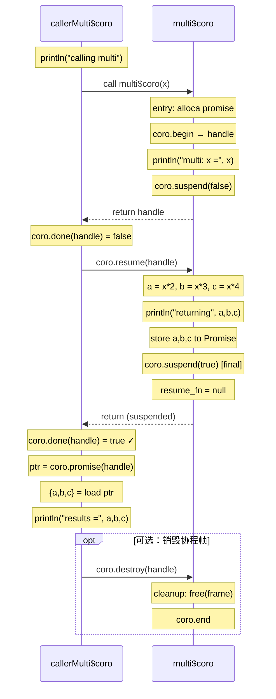

# LLGo LLVM Coroutine 实现报告

## 1. 背景：为什么需要双符号模式

### 1.1 Go Goroutine 与 LLVM Coroutine 的本质差异

Go 的 goroutine 是**有栈协程**，每个 goroutine 拥有独立的栈空间，挂起时通过保存 SP/PC/BP 实现状态保存，恢复时直接 JMP 到保存的地址继续执行。

LLVM Coroutine 是**无栈协程**，没有独立栈，共享调用者的栈。挂起时栈帧会被销毁，只有跨挂起点存活的变量会被保存到堆上的协程帧中。

| 特性 | Go Goroutine | LLVM Coroutine |
|------|-------------|----------------|
| 栈 | 独立栈，挂起时保留 | 无独立栈，挂起时销毁 |
| 挂起位置 | 任意位置（隐式） | 仅 suspend point（显式） |
| 嵌套调用 | 透明支持 | 需要函数着色 |

### 1.2 函数着色问题

LLVM Coroutine 的最大挑战是**函数着色**。当 A→B→C 调用链中 C 需要挂起时，整个调用链都必须是协程函数——这就是"着色传染"。

### 1.3 双符号模式的提出

为解决着色问题并保持与现有代码的兼容性，我们提出**双符号模式**：

- 每个函数同时生成**同步版本**和**协程版本**（`$coro` 后缀）
- `go` 关键字作为着色边界
- 同步世界零开销，异步世界完整支持

---

## 2. 两个世界的差异

### 2.1 执行顺序差异

```go
func worker() {
    println("start")
    coroSuspend()
    println("end")
}

func main() {
    worker()           // 同步调用
    go worker()        // 异步调用
    println("main")
}
```

**同步世界**的执行顺序：`start → end → main`（worker 完整执行后 main 继续）

**异步世界**的执行顺序：`start → main → end`（worker suspend 后 main 继续，调度器恢复 worker）

### 2.2 函数签名差异（ABI 差异）

**同步版本**：签名 `(参数) → 返回值`，阻塞执行

**协程版本**：签名 `(参数) → ptr`，返回协程句柄

#### 关键 ABI 区别

| 调用场景 | 同步版本 | 协程版本 |
|---------|---------|---------|
| 函数签名 | `func(args) returns` | `func$coro(args) ptr` |
| 返回值 | 直接返回 | 存储在 Promise 中 |
| 获取返回值 | 函数返回后立即可用 | await 完成后从 Promise 读取 |
| 调用开销 | 普通函数调用 | 协程帧分配 + 调度 |

#### 返回值处理示例

```go
func compute(x int) int {
    coroSuspend()
    return x * 2
}

func caller() {
    result := compute(10)  // 如何获取返回值？
}
```

**同步调用**（`caller` 调用 `compute`）：
```llvm
%result = call i64 @compute(i64 10)  ; 直接获取返回值
```

**协程调用**（`caller$coro` 调用 `compute$coro`）：
```llvm
%handle = call ptr @compute$coro(i64 10)  ; 获取协程句柄
; ... await 逻辑，等待 compute$coro 完成 ...
%promise = call ptr @llvm.coro.promise(ptr %handle, i32 8, i1 false)
%result = load i64, ptr %promise          ; 从 Promise 读取返回值
call void @llvm.coro.destroy(ptr %handle) ; 销毁协程帧
```

### 2.3 自动 Await 保证顺序一致性

当 `A$coro` 调用 `B$coro` 时，编译器自动插入 await 逻辑，采用**协作式等待**：子协程 suspend 时，父协程也 suspend，让出控制权给调度器。

---

## 3. 双符号的调用规则与 IR 示例

### 3.1 示例源码

```go
func worker(id int) {
    println("worker", id, ": start")
    coroSuspend()
    println("worker", id, ": done")
}

func helper(id int) {
    println("helper", id, ": calling worker")
    worker(id)
    println("helper", id, ": worker returned")
}

func main() {
    helper(0)         // 普通调用
    go helper(1)      // go 调用
    go helper(2)      // go 调用
}
```

### 3.2 生成的符号

| 函数 | 同步版本 | 协程版本 |
|------|---------|---------|
| worker | `worker()` | `worker$coro()` |
| helper | `helper()` | `helper$coro()` |
| main | `main()` | `main$coro()` |

### 3.3 同步版本：worker()

同步版本中 `coroSuspend()` **不生成任何代码**：

```llvm
define void @worker(i64 %id) {
    call void @PrintString("worker")
    call void @PrintInt(i64 %id)
    call void @PrintString(": start")
    ; coroSuspend 被跳过，没有任何代码
    call void @PrintString("worker")
    call void @PrintInt(i64 %id)
    call void @PrintString(": done")
    ret void
}
```

### 3.4 同步版本：helper() 调用 worker()

同步版本内部调用同步版本：

```llvm
define void @helper(i64 %id) {
    call void @PrintString("helper : calling worker")
    call void @worker(i64 %id)              ; ← 调用同步版本
    call void @PrintString("helper : worker returned")
    ret void
}
```

### 3.5 main() 中的普通调用 vs go 调用

```llvm
define void @main() {
    ; 普通调用 - 使用同步版本
    call void @helper(i64 0)

    ; go 调用 - 使用 $coro 版本 + CoroSpawn
    %h1 = call ptr @helper$coro(i64 1)      ; ← 调用协程版本
    call void @CoroSpawn(ptr %h1)           ; ← 入队调度

    %h2 = call ptr @helper$coro(i64 2)
    call void @CoroSpawn(ptr %h2)

    call void @PrintString("main: done")
    ret void
}
```

### 3.6 协程版本：worker$coro() 的完整结构

```llvm
; Function Attrs: presplitcoroutine
define ptr @worker$coro(i64 %id) #0 {
; ==================== RAMP 区块（首次调用） ====================
entry:
    %token = call token @llvm.coro.id(i32 0, ptr null, ptr null, ptr null)
    %need_alloc = call i1 @llvm.coro.alloc(token %token)
    br i1 %need_alloc, label %alloc, label %init

alloc:
    %size = call i64 @llvm.coro.size.i64()
    %mem = call ptr @malloc(i64 %size)
    br label %init

init:
    %frame = phi ptr [ null, %entry ], [ %mem, %alloc ]
    %handle = call ptr @llvm.coro.begin(token %token, ptr %frame)
    br label %body

; ==================== RESUME 区块（函数主体） ====================
body:
    call void @PrintString("worker : start")

    ; coroSuspend() 编译为中间 suspend
    %r1 = call i8 @llvm.coro.suspend(token none, i1 false)
    switch i8 %r1, label %unreachable [
        i8 0, label %resumed    ; 被 resume，继续执行
        i8 1, label %cleanup    ; 被 destroy，去清理
    ]

resumed:
    call void @PrintString("worker : done")
    br label %final

final:
    ; final suspend (i1 true)
    %r2 = call i8 @llvm.coro.suspend(token none, i1 true)
    switch i8 %r2, label %unreachable [
        i8 0, label %unreachable    ; final 不会被 resume
        i8 1, label %cleanup
    ]

; ==================== DESTROY 区块（清理） ====================
cleanup:
    %mem_to_free = call ptr @llvm.coro.free(token %token, ptr %handle)
    call void @free(ptr %mem_to_free)
    br label %end

end:
    call i1 @llvm.coro.end(ptr %handle, i1 false, token none)
    ret ptr %handle
}
```

### 3.7 协程版本：helper$coro() 调用 worker$coro() + await

`$coro` 函数内部调用其他 `$coro` 函数时，生成 **await 逻辑**：

```llvm
define ptr @helper$coro(i64 %id) #0 {
; ... RAMP 区块省略 ...

body:
    call void @PrintString("helper : calling worker")

    ; 调用 worker$coro，获取句柄
    %worker_handle = call ptr @worker$coro(i64 %id)
    br label %await_loop

; ==================== AWAIT 逻辑 ====================
await_loop:
    ; 检查 worker 是否完成
    %done1 = call i1 @llvm.coro.done(ptr %worker_handle)
    br i1 %done1, label %await_done, label %await_resume

await_resume:
    ; worker 未完成，resume 它
    call void @llvm.coro.resume(ptr %worker_handle)
    br label %await_check

await_check:
    ; 再次检查
    %done2 = call i1 @llvm.coro.done(ptr %worker_handle)
    br i1 %done2, label %await_done, label %await_suspend

await_suspend:
    ; worker 还在 suspend，我也 suspend（协作式等待）
    %r = call i8 @llvm.coro.suspend(token none, i1 false)
    switch i8 %r, label %unreachable [
        i8 0, label %await_loop    ; 被唤醒后重新检查
        i8 1, label %cleanup
    ]

await_done:
    ; worker 完成，继续执行后续代码
    call void @PrintString("helper : worker returned")
    br label %final

; ... final suspend 和 cleanup 省略 ...
}
```

### 3.8 协程帧布局

```
+0:  resume_fn   → func$coro.resume 地址，完成时为 null
+8:  destroy_fn  → func$coro.destroy 地址
+16: promise     → 返回值存储位置（类型由函数返回类型决定）
+..: state       → 当前挂起点编号
+..: 局部变量    → 跨挂起存活的变量（如 %id）
```

**Promise 位置**：Promise 始终位于 offset 16，通过 `llvm.coro.promise(handle, alignment, false)` 访问。

LLVM CoroSplit Pass 将函数拆分为：
- `worker$coro` (ramp): 首次调用入口
- `worker$coro.resume`: 恢复执行
- `worker$coro.destroy`: 清理资源

使用 `llvm.coro.done(handle)` 检测 `resume_fn == null` 判断协程是否完成。

---

## 4. Taint 传播分析

编译 `$coro` 版本时，需要判断被调用函数是否包含 suspend 点：
- 直接调用 `coroSuspend` → tainted
- 调用其他 tainted 函数 → tainted（递归传播）

对 tainted 函数：调用其 `$coro` 版本并插入 await。

---

## 5. 边界情况

### 5.1 C 调用 Go

**问题**：C 代码通过函数指针或导出符号调用 Go 函数时，C 不理解协程语义，无法处理返回的协程句柄。

**解决方案**：C 代码只能调用同步版本（`func`），不能调用 `func$coro`。由于同步版本中 `coroSuspend()` 不生成任何代码，C 调用 Go 函数时会直接阻塞执行到函数返回，符合 C 的预期语义。

**限制**：如果 Go 函数内部依赖 suspend 点来实现某些功能（如等待 channel），在 C 调用场景下这些功能会失效。这是有栈/无栈混合模型的固有限制。

### 5.2 Go 调用 C

**问题**：`$coro` 函数内部调用 C 函数时，C 函数没有 `$coro` 版本，如何处理？

**解决方案**：C 函数视为"非 tainted"，直接调用其同步版本，不插入 await 逻辑。调用是阻塞的，C 函数执行完毕后继续执行后续代码。

**限制**：C 函数内部不能有挂起点，也不能回调可能挂起的 Go 函数。如果 C 回调 Go，该回调只能走同步路径。这意味着 C 作为"着色边界"，切断了协程的传播链。

```
Go$coro → C → Go（只能同步）
```

### 5.3 反射调用

**问题**：`reflect.Value.Call()` 在运行时动态调用函数，编译期无法确定目标函数。如何选择调用同步版本还是协程版本？

**讨论**：
- 方案 A：反射统一调用同步版本。简单但丢失协程语义。
- 方案 B：为每个函数生成反射元数据，包含两个版本的入口。运行时根据调用上下文选择版本。
- 方案 C：反射调用时检查当前是否在 `$coro` 上下文中，动态选择版本。

**当前 MVP**：统一走同步版本（方案 A）。后续可考虑方案 C，但需要运行时支持"协程上下文"检测。

### 5.4 闭包

**问题**：闭包是匿名函数，可能捕获外部变量。闭包是否需要生成双符号？

**讨论**：
- 如果闭包内部包含 suspend 点或调用 tainted 函数，需要生成 `closure$coro` 版本
- 闭包捕获的变量需要在协程帧中正确存储（跨挂起点存活）
- 闭包作为 `go` 语句目标时，需要调用其 `$coro` 版本

**当前 MVP**：闭包统一走同步版本。完整支持需要：
1. 闭包 taint 分析
2. 闭包双符号生成
3. 闭包协程帧中正确存储捕获变量

### 5.5 接口方法调用

**问题**：接口方法调用是间接调用，编译期不知道具体实现类型。如何选择同步/协程版本？

```go
type Worker interface {
    Work()
}

func runWorker(w Worker) {
    w.Work()  // 编译期不知道调用哪个实现
}
```

**讨论**：
- 方案 A：接口方法统一调用同步版本
- 方案 B：接口 itab 中存储两个方法指针（sync 和 coro），运行时根据上下文选择
- 方案 C：生成 `runWorker$coro` 时，假设所有接口方法都可能 suspend，插入 await 逻辑

**当前 MVP**：统一走同步版本（方案 A）。方案 B 需要修改接口布局，影响较大；方案 C 可能导致不必要的 await 开销。

### 5.6 返回值处理：Promise 机制（已实现）

**问题**：`$coro` 版本签名是 `(参数) → ptr`（返回协程句柄），原始返回值需要另外获取。

**解决方案**：使用 LLVM Coroutine 的 **Promise** 机制存储返回值。

#### Promise 设计

Promise 是在协程入口通过 `alloca` 分配的局部变量，其地址传递给 `llvm.coro.id`。LLVM CoroSplit Pass 会自动将 Promise 重定位到协程帧中，确保跨挂起点存活。

```llvm
; 协程帧布局（CoroSplit 后）
%Frame = type {
    ptr,    ; +0:  resume_fn（完成时为 null）
    ptr,    ; +8:  destroy_fn
    T,      ; +16: promise（返回值存储位置）
    ...     ; 其他跨挂起点存活的变量
}
```

#### 协程函数 Prologue：分配 Promise

```llvm
define ptr @compute$coro(i64 %x) #presplitcoroutine {
entry:
    ; 分配 Promise（存储返回值）
    %promise = alloca i64, align 8

    ; 创建协程 ID，传入 Promise 地址
    %id = call token @llvm.coro.id(i32 0, ptr %promise, ptr null, ptr null)
    %need_alloc = call i1 @llvm.coro.alloc(token %id)
    br i1 %need_alloc, label %alloc, label %begin
    ; ...
}
```

#### 存储返回值：return 语句编译

```go
func compute(x int) int {
    coroSuspend()
    return x * 2  // 编译为 store + jump to final suspend
}
```

```llvm
; return x * 2 编译为：
%result = mul i64 %x, 2
store i64 %result, ptr %promise    ; 存储到 Promise
br label %final_suspend            ; 跳转到 final suspend
```

#### 读取返回值：await 完成后

```llvm
; caller$coro 中调用 compute$coro 并获取返回值
%handle = call ptr @compute$coro(i64 10)

; await 逻辑
await_loop:
    %done = call i1 @llvm.coro.done(ptr %handle)
    br i1 %done, label %await_done, label %await_resume
    ; ...

await_done:
    ; 使用 llvm.coro.promise 获取 Promise 指针
    %promise_ptr = call ptr @llvm.coro.promise(ptr %handle, i32 8, i1 false)
    %result = load i64, ptr %promise_ptr

    ; 销毁协程帧（返回值已读取）
    call void @llvm.coro.destroy(ptr %handle)
    ; 继续使用 %result ...
```

#### 多返回值处理

对于多返回值函数，Promise 类型是包含所有返回值的结构体：

```go
func multi(x int) (int, int, int) {
    coroSuspend()
    return x*2, x*3, x*4
}
```

```llvm
; Promise 类型
%MultiReturn = type { i64, i64, i64 }

; 存储多个返回值
%promise = alloca %MultiReturn
; ...
%ptr0 = getelementptr %MultiReturn, ptr %promise, i32 0, i32 0
store i64 %a, ptr %ptr0
%ptr1 = getelementptr %MultiReturn, ptr %promise, i32 0, i32 1
store i64 %b, ptr %ptr1
%ptr2 = getelementptr %MultiReturn, ptr %promise, i32 0, i32 2
store i64 %c, ptr %ptr2
```

#### 结构体返回值

结构体返回值直接作为 Promise 类型：

```go
type Point struct { X, Y int }

func makePoint(x int) Point {
    coroSuspend()
    return Point{x*2, x*3}
}
```

```llvm
; Promise 就是 Point 结构体
%promise = alloca %Point  ; { i64, i64 }
; ...
store %Point { i64 %x2, i64 %x3 }, ptr %promise
```

#### Final Suspend 与 Frame 生命周期

关键点：**final suspend 后，协程帧必须保持有效**，直到调用者读取完返回值并调用 `coro.destroy`。

```
协程执行流程：
1. compute$coro 存储返回值到 Promise
2. compute$coro 到达 final suspend，设置 resume_fn = null
3. caller$coro 通过 coro.done 检测到完成
4. caller$coro 通过 coro.promise 读取返回值
5. caller$coro 调用 coro.destroy 释放协程帧
```

实现中，final suspend 的 default 路径（-1）跳转到 `coro.end` 但**不释放帧**：

```llvm
final_suspend:
    %fs = call i8 @llvm.coro.suspend(token none, i1 true)
    switch i8 %fs, label %suspend [
        i8 0, label %cleanup,    ; 被 destroy 调用
        i8 1, label %cleanup
    ]

suspend:
    ; 不释放帧，直接到 end
    br label %end

cleanup:
    ; 释放帧（由 coro.destroy 触发）
    %mem = call ptr @llvm.coro.free(token %id, ptr %handle)
    call void @free(ptr %mem)
    br label %end

end:
    call i1 @llvm.coro.end(ptr %handle, i1 false, token none)
    ret ptr %handle
```

---

## 6. 完整示例：多返回值函数的协程编译

以 `multi` 函数为例，详细展示协程各区块的生成逻辑。

### 6.1 源码

```go
func multi(x int) (int, int, int) {
    println("multi: x =", x)
    coroSuspend()
    a := x * 2
    b := x * 3
    c := x * 4
    println("multi: returning", a, b, c)
    return a, b, c
}

func callerMulti(x int) {
    println("callerMulti: calling multi")
    a, b, c := multi(x)
    println("callerMulti: results =", a, b, c)
}
```

### 6.2 同步版本 `multi`

同步版本中 `coroSuspend()` 不生成任何代码，函数直接执行完毕返回：

```llvm
; 签名：(i64) -> { i64, i64, i64 }  直接返回三元组
define { i64, i64, i64 } @multi(i64 %0) {
entry:
  ; println("multi: x =", x)
  call void @PrintString("multi: x =")
  call void @PrintInt(i64 %0)

  ; coroSuspend() 在同步版本中 **完全不生成代码**

  ; a, b, c = x*2, x*3, x*4
  %1 = mul i64 %0, 2              ; a = x * 2
  %2 = mul i64 %0, 3              ; b = x * 3
  %3 = mul i64 %0, 4              ; c = x * 4

  ; println("multi: returning", a, b, c)
  call void @PrintString("multi: returning")
  call void @PrintInt(i64 %1)
  call void @PrintInt(i64 %2)
  call void @PrintInt(i64 %3)

  ; 构造返回值元组 { a, b, c }
  %4 = insertvalue { i64, i64, i64 } undef, i64 %1, 0
  %5 = insertvalue { i64, i64, i64 } %4, i64 %2, 1
  %6 = insertvalue { i64, i64, i64 } %5, i64 %3, 2
  ret { i64, i64, i64 } %6        ; 直接返回三元组
}
```

### 6.3 协程版本 `multi$coro` 区块结构

```
┌────────────────────────────────────────────────────────────────────────────┐
│  multi$coro 协程版本                                                        │
│  签名: (i64) → ptr   返回协程句柄，真正的返回值存在 Promise 中               │
├────────────────────────────────────────────────────────────────────────────┤
│                                                                            │
│  entry                                                                     │
│  ┌────────────────────────────────────────┐                                │
│  │ %promise = alloca { i64, i64, i64 }    │ ← Promise: 存储 (a,b,c)        │
│  │ %id = coro.id(0, %promise, null, null) │ ← 关联 Promise                 │
│  │ %need = coro.alloc(%id)                │ ← 是否需要 malloc?             │
│  │ br %need, allocBlk, beginBlk           │                                │
│  └─────────────┬──────────────────────────┘                                │
│                │                                                           │
│       ┌────────┴────────┐                                                  │
│       ▼                 ▼                                                  │
│  allocBlk          beginBlk                                                │
│  ┌─────────────┐   ┌─────────────────────────────────────┐                 │
│  │ %size=size()│   │ %mem = phi [null, entry], [%m, alloc]│                │
│  │ %m = malloc │   │ %handle = coro.begin(%id, %mem)     │ ← Handle        │
│  │ br beginBlk │   │ br bodyBlk                          │                 │
│  └─────────────┘   └──────────────────┬──────────────────┘                 │
│                                       │                                    │
│                                       ▼                                    │
│  ═══════════════════════════════ 函数体 ═══════════════════════════════    │
│                                                                            │
│  bodyBlk                                                                   │
│  ┌────────────────────────────────────────┐                                │
│  │ println("multi: x =", x)               │                                │
│  │                                        │                                │
│  │ ; ===== coroSuspend() 编译为 ===== ;   │                                │
│  │ %r = coro.suspend(none, false)         │ ← 非 final suspend             │
│  │ switch %r:                             │                                │
│  │   default(-1) → suspendBlk (返回handle)│                                │
│  │   0 → resumeBlk (继续执行)             │                                │
│  │   1 → cleanupBlk                       │                                │
│  └────────────────────────────────────────┘                                │
│                │                                                           │
│       ┌────────┼────────┬─────────────────┐                                │
│       ▼        ▼        ▼                 │                                │
│  suspendBlk resumeBlk  cleanupBlk         │                                │
│  ┌────────┐ ┌────────────────────────────────────────────┐                 │
│  │ret hdl │ │ %a = x * 2                                 │                 │
│  └────────┘ │ %b = x * 3                                 │                 │
│     ↑       │ %c = x * 4                                 │                 │
│  Ramp函数   │ println("multi: returning", %a, %b, %c)    │                 │
│  返回点     │                                            │                 │
│             │ ; ===== return a,b,c 编译为 ===== ;        │                 │
│             │ GEP promise[0] → store %a                  │                 │
│             │ GEP promise[1] → store %b                  │                 │
│             │ GEP promise[2] → store %c                  │                 │
│             │ br exitBlk                                 │                 │
│             └────────────────────────────────────────────┘                 │
│                                       │                                    │
│  ═══════════════════════════ Final Suspend ════════════════════════════    │
│                                       ▼                                    │
│  exitBlk (final suspend)                                                   │
│  ┌────────────────────────────────────────┐                                │
│  │ %fs = coro.suspend(none, true)         │ ← final=true                   │
│  │ switch %fs:                            │                                │
│  │   default(-1) → finalSuspendBlk        │                                │
│  │   0 → cleanupBlk                       │                                │
│  │   1 → cleanupBlk                       │                                │
│  └────────────────────────────────────────┘                                │
│                │                                                           │
│       ┌────────┼────────┐                                                  │
│       ▼        ▼        ▼                                                  │
│  finalSusp  cleanupBlk                                                     │
│  ┌────────┐ ┌─────────────────────┐                                        │
│  │br endBlk│ │%mem = coro.free()  │                                        │
│  └───┬────┘ │call free(%mem)      │                                        │
│      │      │br endBlk            │                                        │
│  不释放帧   └──────────┬──────────┘                                        │
│      │                │ 释放帧                                              │
│      └────────────────┤                                                    │
│                       ▼                                                    │
│  endBlk                                                                    │
│  ┌────────────────────────────────────────┐                                │
│  │ coro.end(%handle, false)               │                                │
│  │ ret ptr %handle                        │                                │
│  └────────────────────────────────────────┘                                │
│                                                                            │
└────────────────────────────────────────────────────────────────────────────┘
```

### 6.4 各区块 IR 详解

#### Entry 区块

```llvm
entry:
  ; 1. 分配 Promise（多返回值用结构体）
  %promise = alloca { i64, i64, i64 }, align 8

  ; 2. 创建协程 ID，第二个参数是 Promise 地址
  %id = call token @llvm.coro.id(i32 0, ptr %promise, ptr null, ptr null)

  ; 3. 检查是否需要动态分配帧
  %need_alloc = call i1 @llvm.coro.alloc(token %id)
  br i1 %need_alloc, label %allocBlk, label %beginBlk
```

| 指令 | 作用 |
|------|------|
| `alloca {i64,i64,i64}` | 分配 Promise，存储三个返回值 |
| `coro.id(0, %promise, ...)` | 创建协程 ID，**关联 Promise 地址** |
| `coro.alloc` | 询问 LLVM 是否需要动态分配帧 |

#### Alloc 区块

```llvm
allocBlk:
  %size = call i64 @llvm.coro.size.i64()    ; 获取帧大小
  %mem = call ptr @malloc(i64 %size)        ; C malloc 分配
  br label %beginBlk
```

#### Begin 区块

```llvm
beginBlk:
  %phi_mem = phi ptr [ null, %entry ], [ %mem, %allocBlk ]
  %handle = call ptr @llvm.coro.begin(token %id, ptr %phi_mem)
  br label %bodyBlk
```

| 指令 | 作用 |
|------|------|
| `phi` | 合并内存来源：不需要分配用 null，否则用 malloc 结果 |
| `coro.begin` | **创建协程句柄**，后续所有操作都用这个句柄 |

#### Body 区块（函数体 + 中间 suspend）

```llvm
bodyBlk:
  ; println("multi: x =", x)
  call void @PrintString(...)
  call void @PrintInt(i64 %x)

  ; coroSuspend() 编译为：
  %r = call i8 @llvm.coro.suspend(token none, i1 false)  ; false = 非 final
  switch i8 %r, label %suspendBlk [
    i8 0, label %resumeBlk     ; 被 resume，继续执行
    i8 1, label %cleanupBlk    ; 被 destroy，去清理
  ]
```

**coro.suspend 返回值含义**：

| 返回值 | 含义 | 跳转目标 |
|--------|------|----------|
| -1 (default) | 挂起成功 | suspendBlk: `ret %handle` 返回句柄 |
| 0 | 被 `coro.resume` 恢复 | resumeBlk: 继续执行后续代码 |
| 1 | 被 `coro.destroy` 调用 | cleanupBlk: 清理资源 |

#### Suspend 区块（Ramp 函数返回点）

```llvm
suspendBlk:
  ret ptr %handle    ; 返回协程句柄给调用者
```

这是 **Ramp 函数的返回点**。第一次调用 `multi$coro(x)` 时，执行到 `coro.suspend` 返回 -1，跳到这里返回句柄。

#### Resume 区块（恢复后继续执行）

```llvm
resumeBlk:
  %a = mul i64 %x, 2     ; a = x * 2
  %b = mul i64 %x, 3     ; b = x * 3
  %c = mul i64 %x, 4     ; c = x * 4

  ; println("multi: returning", a, b, c)
  call void @PrintString(...)
  call void @PrintInt(i64 %a)
  call void @PrintInt(i64 %b)
  call void @PrintInt(i64 %c)

  ; return a, b, c 编译为：存储到 Promise
  %ptr0 = getelementptr { i64, i64, i64 }, ptr %promise, i32 0, i32 0
  store i64 %a, ptr %ptr0    ; Promise[0] = a
  %ptr1 = getelementptr { i64, i64, i64 }, ptr %promise, i32 0, i32 1
  store i64 %b, ptr %ptr1    ; Promise[1] = b
  %ptr2 = getelementptr { i64, i64, i64 }, ptr %promise, i32 0, i32 2
  store i64 %c, ptr %ptr2    ; Promise[2] = c

  br label %exitBlk          ; 跳转到 final suspend
```

**关键**：`return a, b, c` 不是真的返回，而是：
1. 通过 GEP 获取 Promise 各字段地址
2. `store` 存储返回值到 Promise
3. 跳转到 final suspend

#### Exit 区块（Final Suspend）

```llvm
exitBlk:
  %fs = call i8 @llvm.coro.suspend(token none, i1 true)  ; true = final
  switch i8 %fs, label %finalSuspendBlk [
    i8 0, label %cleanupBlk    ; 被 destroy 恢复
    i8 1, label %cleanupBlk    ; cleanup
  ]
```

Final suspend 后，协程标记为 **done**（`resume_fn = null`）。

#### Final Suspend 区块（不释放帧）

```llvm
finalSuspendBlk:
  br label %endBlk    ; 直接去 endBlk，不经过 cleanup
```

**关键**：这里 **不释放帧**！因为调用者还要读取 Promise 中的返回值。

#### Cleanup 区块（释放帧）

```llvm
cleanupBlk:
  %mem_to_free = call ptr @llvm.coro.free(token %id, ptr %handle)
  call void @free(ptr %mem_to_free)
  br label %endBlk
```

只有被 `coro.destroy` 触发时才会执行这里。

#### End 区块

```llvm
endBlk:
  call i1 @llvm.coro.end(ptr %handle, i1 false, token none)
  ret ptr %handle
```

所有路径最终汇聚到这里，调用 `coro.end` 并返回句柄。

### 6.5 调用者 `callerMulti$coro` 的 Await 逻辑

```llvm
define ptr @callerMulti$coro(i64 %x) {
  ; ... prologue 省略 ...

bodyBlk:
  ; println("callerMulti: calling multi")
  call void @PrintString(...)

  ; 调用 multi$coro，获取句柄
  %callee_handle = call ptr @multi$coro(i64 %x)
  br label %awaitLoop

; ====== Await 循环 ======
awaitLoop:
  %done1 = call i1 @llvm.coro.done(ptr %callee_handle)
  br i1 %done1, label %awaitDone, label %awaitResume

awaitResume:
  call void @llvm.coro.resume(ptr %callee_handle)
  br label %awaitCheck

awaitCheck:
  %done2 = call i1 @llvm.coro.done(ptr %callee_handle)
  br i1 %done2, label %awaitDone, label %awaitSuspend

awaitSuspend:
  ; callee 还在挂起，我也挂起（协作式等待）
  %r = call i8 @llvm.coro.suspend(token none, i1 false)
  switch i8 %r, label %suspendBlk [
    i8 0, label %awaitLoop    ; 被恢复后继续检查
    i8 1, label %cleanupBlk
  ]

; ====== 读取返回值 ======
awaitDone:
  ; 通过 coro.promise 获取 Promise 指针
  %promise_ptr = call ptr @llvm.coro.promise(ptr %callee_handle, i32 8, i1 false)

  ; 加载整个结构体
  %result = load { i64, i64, i64 }, ptr %promise_ptr

  ; 解构三个返回值
  %a = extractvalue { i64, i64, i64 } %result, 0
  %b = extractvalue { i64, i64, i64 } %result, 1
  %c = extractvalue { i64, i64, i64 } %result, 2

  ; println("callerMulti: results =", a, b, c)
  call void @PrintString(...)
  call void @PrintInt(i64 %a)
  call void @PrintInt(i64 %b)
  call void @PrintInt(i64 %c)

  br label %exitBlk
  ; ... epilogue 省略 ...
}
```

### 6.6 完整时序图



### 6.7 关键点总结

| 阶段 | 同步版本 | 协程版本 |
|------|---------|---------|
| 函数签名 | `(i64) → {i64,i64,i64}` | `(i64) → ptr` |
| coroSuspend | 不生成代码 | 生成 `coro.suspend` + switch |
| return | `insertvalue` + `ret` | `store` 到 Promise + `br exitBlk` |
| 返回值获取 | 调用返回后立即可用 | await 完成后从 Promise 读取 |
| 帧生命周期 | 栈帧，函数返回自动销毁 | 堆帧，需要 `coro.destroy` 释放 |

---

## 7. 总结

### 7.1 核心要点

1. **双符号**：每个函数生成 `func` 和 `func$coro` 两个版本
2. **ABI 差异**：同步版本直接返回值，协程版本返回句柄 + Promise 存储返回值
3. **调用规则**：普通调用用同步版本，go 语句用 `$coro` 版本，`$coro` 内部只调用 `$coro`（C 除外）
4. **自动 await**：`$coro` 调用 `$coro` 时自动生成协作式等待逻辑，await 完成后从 Promise 读取返回值
5. **taint 分析**：递归识别包含 suspend 点的函数
6. **Promise 机制**：返回值存储在协程帧 offset 16 位置，通过 `llvm.coro.promise` 访问

### 7.2 协程区块生成规则

| 区块 | 生成时机 | 作用 |
|------|---------|------|
| entry | Prologue | alloca promise, coro.id, coro.alloc |
| allocBlk | Prologue | malloc 分配协程帧 |
| beginBlk | Prologue | phi 合并内存, coro.begin 创建句柄 |
| bodyBlk | 函数体 | 用户代码 + coroSuspend 编译 |
| suspendBlk | coroSuspend | Ramp 函数返回点，ret handle |
| resumeBlk | coroSuspend | resume 后继续执行的代码 |
| exitBlk | Epilogue | final suspend |
| finalSuspendBlk | Epilogue | 不释放帧，直接跳 endBlk |
| cleanupBlk | Epilogue | coro.free + free 释放帧 |
| endBlk | Epilogue | coro.end + ret handle |

### 7.3 已验证的返回值类型

| 类型 | 同步调用 | 异步调用 |
|------|---------|---------|
| 单个标量 (int) | ✓ | ✓ |
| 多返回值 (int, int, int) | ✓ | ✓ |
| 结构体 (Point) | ✓ | ✓ |
| 结构体指针 (*Point) | ✓ | ✓ |
| 混合类型 (Point, int, *Point) | ✓ | ✓ |
